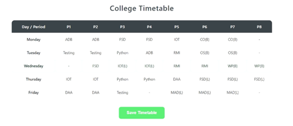

# Students Utility App

A collaborative college portal developed by a team of three, built using the **MERN stack** with **Vite React** for the frontend, **Express.js** for the backend, and **MongoDB Atlas** for cloud database storage.  
The platform is designed to centralize and simplify student activities, enabling them to access academic information, participate in events, and manage their college tasks in one place.

---

## Features

### 1. Authentication
Secure login and registration system to ensure only authorized students can access the portal.

---

### 2. Home Page
Acts as the central navigation hub for all features and services within the portal.

---

### 3. Events Informing
Displays upcoming events, workshops, and important college announcements.

---

### 4. Feedback Page
Allows students to submit feedback or report issues to the college administration.

---

### 5. Notes Sharing
A section where students can share and access academic notes across different subjects.

---

### 6. Assignment Due Creation
Students can track and manage assignment due dates for better time management.

---

### 7. Timetable
Provides students with their academic schedule for classes, labs, and other activities.

---

### 8. Student Marks View
Allows students to securely view their grades and performance records.

---

## Tech Stack
- **Frontend**: React (Vite)
- **Backend**: Node.js, Express.js
- **Database**: MongoDB Atlas
- **Authentication**: JWT-based authentication
